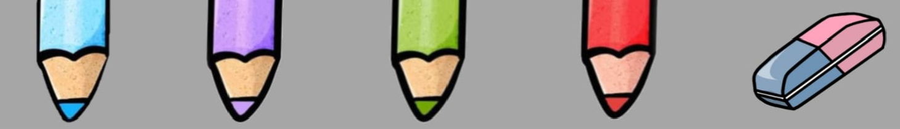

# ✋ Air Drawing Board

A real-time hand gesture–controlled drawing application built with **OpenCV** and **MediaPipe**. Draw in the air using just your index finger — no mouse, no stylus, just your hand in front of a webcam.



---

## Features

- 🎨 **4 colors** — Blue, Lavender, Green, Red
- 🧹 **Eraser** tool via the toolbar
- 🖐️ **Clear canvas** instantly with all five fingers open
- 📷 Real-time webcam feed with drawing overlay
- Separate canvas window for a clean view of your artwork

---

## Gesture Controls

| Gesture | Action |
|---|---|
| ☝️ Index finger up | **Draw** |
| 🤘 Index + Thumb up | **Select** color / tool from toolbar |
| 🖐️ All fingers open | **Clear** the canvas |

---

## Project Structure

```
air-drawing-board/
│
├── README.md
├── requirements.txt
│
├── assets/
│   └── ThePens.png          # Toolbar image (colors + eraser)
│
├── HandTrackerModel.py      # MediaPipe hand detection wrapper
└── painter.py               # Main application
```

---

## Installation

**1. Clone the repository**
```bash
git clone https://github.com/malakhishams/Air-Drawing-Board
cd Air-Drawing-Board
```

**2. Install dependencies**
```bash
pip install -r requirements.txt
```

**3. Run the app**
```bash
python painter.py
```

Press **`q`** to quit.

---

## Requirements

- Python 3.7+
- Webcam

See `requirements.txt` for Python package dependencies.

---

## Notes

- The app is currently configured for a **730×1200 (portrait)** resolution — best used with a phone-style vertical webcam setup. To use a standard 640×480 webcam, update the resolution values in `painter.py`.
- Make sure `pens-use.jpg` is inside the `assets/` folder and that the path in `painter.py` points to `assets/pens-use.jpg`.
- Lighting conditions affect hand detection accuracy. A well-lit environment gives the best results.

---

## Built With

- [OpenCV](https://opencv.org/) — computer vision & drawing
- [MediaPipe](https://mediapipe.dev/) — real-time hand landmark detection
- [NumPy](https://numpy.org/) — canvas array management

---

## Author

Made by **Malak** — CS student @ Ain Shams University :)
